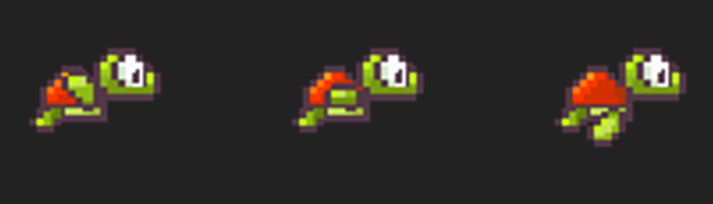
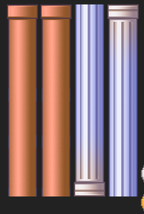
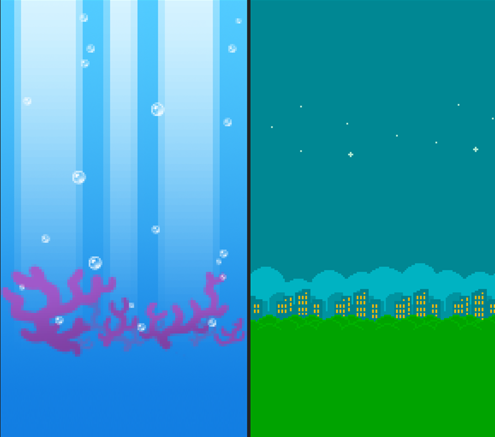

# FlappyTurtle Project

### Group Members
- Andy Nguyen
 

## Executive Summary
The game will be my interpretation of the World Famous Game Flappy Bird. I want to be as close as possible to the original game with optimization to the code and some new features such as upside-down mode after a checkpoint. The game will be a side-scroller like the original game with the same looks and feel. The target audience is casual gamers who want to burn time in a fun way. The game flow will be faster and faster as the point increases.

The game will have different textures compared to the original games and other game mechanics like items with  powers like slowing down time or the world getting flipped around being upside down.

## Game Description

#### Overview
The big picture of the game is that the turtle is endlessly swimming and trying not to die by crashing into the columns. The player will earn one point by going through the column and not dying in the process. The main quest is trying to gain as many points as possible, and the game will go on endlessly after every 30 points; the game will randomly pick a challenge for the player from the challenges category (Inverse, Upside down)

#### The Quest

The main quest of the game is gaining points and scoring high scores. If the player reaches a new high score, the player will see the turtle's skin change slightly. The game is broken into intermediate stages of gameplay rather than levels because the game is designed to play endlessly rather than an end game. The game's obstacles are mainly the pillars and the timing the player has to make the bird goes up. The player will gain a point after the player manages to fly through the opening between the pipes.

#### Main Character

The original game's main character was a bird, but it will be a turtle for my implementation. The turtle will navigate through the game in an oceanic environment. The turtle will have different skins according to the player's high score. The player will constantly be going diving down and to the left; the only control is making the bird go up by pressing space.

#### Sketch of main character

#### Opponents

The primary opponent in the game is the pillars, and it's straightforward if the turtle touches the pillar, it dies. The game will randomly generate the pillars at different heights to make the game more challenging. The column's textures will alternate between making the game look more colourful and appealing. Usually, the pillars will spawn from the right side and the left side when inversed.

#### Sketch of Opponents

#### Environment

The environment will be underwater and the night sky with the city in the background.

#### Sketch of world

#### Menus

This is the title menu

There will be a button for the user to rate the game, a button to start playing and a button to access the leader board.

There will also be a pause menu and game over menu for the game

#### Controls

For the controls of the game, there will be only one control and that is pressing the space bar to make the turtle go up and not touch the bottom of the screen or the pillars

#### Sounds

There are sounds for the game such as the sound when the turtle goes up, dying sound and the sound when a button is clicked.

## Summary

The world-famous Flappy Bird game, with its addicting gameplay, now has its successor recreated in C++ ***Flappy turtle***! The game has added exciting modes like time slow, reverse gameplay, inverse gravity, and more in the future! Instead of the yellow bird, the star of the game is now a cute turtle! You can unlock new looks for the turtle just by playing the game!